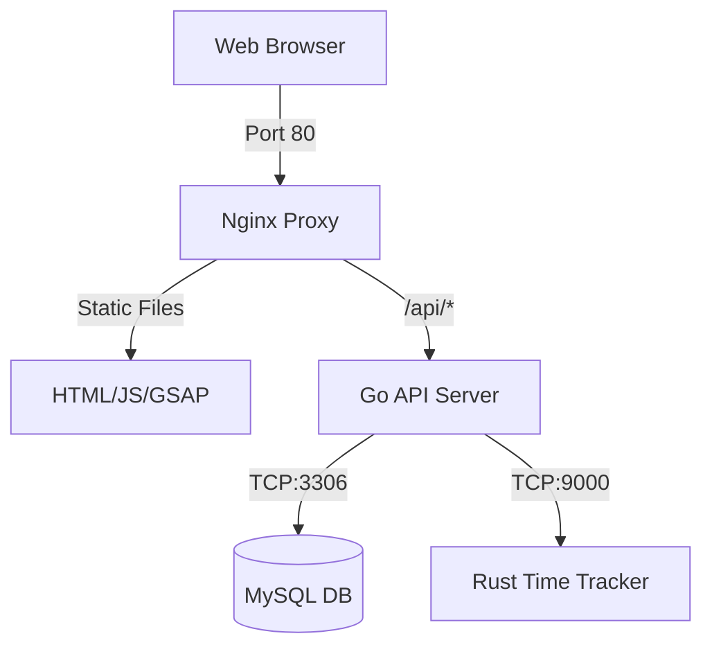

<p align="center">
  <br>
  <b>IT Work Order System – MIVHS</b><br>
  <i>Empowering the IT MIVHS Team with a high-performance, microservices-driven work order and helpdesk management solution.</i>
</p>

<p align="center">
  <a href="https://golang.org"></a>
  <a href="https://www.rust-lang.org"></a>
  <a href="https://www.docker.com"></a>
  <a href="https://opensource.org/licenses/MIT"></a>
</p>

---

## 🌟 Overview

The **IT Work Order System** is a professional-grade platform designed to streamline IT support requests at **SMK MITRA INDUSTRI MM2100**. It combines the rapid development of **Go**, the safety and performance of **Rust**, and a modern, interactive frontend to deliver a seamless experience for both requesters and technicians.

### 🎯 Why This Project?
- **Speed**: Sub-millisecond time-tracking with our Rust engine.
- **Reliability**: Microservices architecture ensures the system stays up even if one component fails.
- **Transparency**: Real-time status tracking for every IT request.
- **Improvement**: Integrated **Kaizen** analytics to help the team grow.

---

## 🏗️ Architecture

The system follows a modern microservices architecture to segregate concerns and optimize performance:

| Service | Technology | Role |
| :--- | :--- | :--- |
| **API Gateway** | Nginx | Reverse proxy, SSL termination, & static file serving. |
| **Core Backend** | Go (Gin) | Orchestrates business logic, authentication, and database interactions. |
| **Rust Engine** | Rust (Axum) | Dedicated high-performance service for precise time tracking. |
| **Storage** | MySQL 8.0 | Persistent data storage with automatic health monitoring. |



---

## ✨ Key Features

### 🔧 For Technicians
- **Instant Assignment**: Take orders with a single click.
- **Safety First**: Integrated safety checklist requirements before starting any job.
- **Live Timers**: Automated work duration tracking powered by Rust.
- **Kaizen Notes**: Submit solutions and improvement ideas upon completion.

### 👤 For Requesters
- **Quick Submission**: Simplified forms for location, device, and problem description.
- **Priority Levels**: Flag urgent issues (High/Urgent) for immediate attention.
- **Real-time Status**: See exactly when your request moves from "Pending" to "On Progress".

### 📊 For Management
- **Summary Dashboard**: Full history of all completed work orders.
- **Performance Metrics**: Automated calculation of completion rates and response times.
- **Team Monitoring**: Real-time view of which team members are "Stand By" vs "On Job".

### ⚙️ Technical Highlights
- **Microservices Orchestration**: Fully containerized setup with health checks.
- **JWT Authentication**: Secure, state-managed sessions for administrators and operators.
- **Failure Resilience**: Automatic connection retry and validation loops.

---

## 🔄 Work Flow

This system follows a structured workflow to handle work orders efficiently:

### **1. Create Work Order (Requests from helpdesk)**
```
Requester/User
  ↓
  Click "Create Orders" button
  ↓
  Fill form:
    - Fill the requester name
    - Priority (High, Medium, Low)
    - Location (Gedung A, B, C, etc)
    - Device (Printer, PC, CCTV, etc)
    - Problem description
  ↓
  Submit → Order enters table with status "Pending"
```

### **2. Take Order (Assign Work)**
```
Technician
  ↓
  View work orders in main table
  ↓
  Click empty slot or order ID
  ↓
  - Select available operators (status: Stand By)
  - Review & approve safety checklist per location
  - Click "Confirm"
  ↓
  Status changes: "Pending" → "On Progress"
  IT Team status: "Stand By" → "On Job"
```

### **3. Work in Progress (Executing Job)**
```
Order status: "On Progress"
  ↓
  Technician executes the work
  ↓
  Working hours are recorded by Rust time tracker service
  ↓
  Can update team member status (Support, etc) if needed
```

### **4. Mark as Done (Complete Job)**
```
Technician
  ↓
  Click "Done" button in table row
  ↓
  (Optional) Fill evaluation notes:
    - What was done
    - Solution applied
    - Notes for improvement
  ↓
  Submit
  ↓
  Status changes: "On Progress" → "Completed"
  Technician status: "On Job" → "Stand By"
  Order enters Summary page
```

### **5. Review Summary (View History)**
```
IT Teacher/Admin
  ↓
  Click "Summary" hyperlink in navbar
  ↓
  View table: Completed work orders with:
    - Order ID, Priority, Time, Requester
    - Location, Device, Problem
    - Completion timestamp
    - Evaluation notes
  ↓
  Can edit notes for additional feedback
  ↓
  Analyze data for Kaizen improvement
```

### **6. Kaizen Activity (Performance Evaluation)**
```
Manager can view metrics:
  - Total work orders
  - Pending orders
  - On progress orders
  - Completed orders
  
Completion Rate = (Completed / Total) × 100%

Rating based on completion rate:
  - Excellent (80%+) → "Keep up the good work"
  - Good (60-79%) → "Focus on reducing pending"
  - Fair (40-59%) → "Consider process improvements"
  - Needs Improvement (<40%) → "Investigate bottlenecks"
```

---

## 🐳 Docker Services

The system consists of four main Docker services structured for isolation:

### Database Service (`db`)
- **Image**: `mysql:8.0`
- **Auto-initialization**: Runs SQL scripts from the `/db` directory on startup.
- **Health Check**: Configured health validation before dependent services start.
- **Volumes**: Persistent local MySQL data storage.

### Time Tracker Service (`time-tracker`)
- **Built from**: `./src/rust-engine` directory.
- **Framework**: Rust with Axum.
- **Purpose**: High-speed, microsecond-accurate time tracking microservice.
- **Port**: 9000 (Internal auth protected).

### Backend Service (`backend`)
- **Built from**: `./src/backend` directory.
- **Framework**: Go with Gin.
- **Dependencies**: Startup sequencing waits for `db` and `time-tracker` to be healthy.
- **Port**: 8080 (Proxied via Nginx).

### Nginx Service (`nginx`)
- **Image**: `nginx:1.25-alpine`
- **Purpose**: Unified entry point acting as a reverse proxy and static file server.
- **Port**: 80 (mapped to host) / 443.

---

## 🚀 Quick Start

### 🐳 Using Docker (Recommended)
The fastest way to get started is using our pre-configured Docker Compose setup.

```bash
# 1. Clone the repository
git clone https://github.com/parothegreat/work-order.git
cd work-order

# 2. Setup your environment variables
cp src/.env.example src/.env

# 3. Fire up the engines
docker-compose up -d --build
```

**Access points:**
- 🏠 **Dashboard**: [http://localhost](http://localhost)
- 📊 **Summary**: [http://localhost/summary](http://localhost/summary)
- 💡 **Kaizen**: [http://localhost/kaizen](http://localhost/kaizen)
- 📖 **TechGuide**: [http://localhost/techguide](http://localhost/techguide)

---

## 🔧 Development

### Prerequisites
- Docker and Docker Compose
- Go 1.21+ (for backend development)
- Rust 1.70+ (for time tracker development)

### Manual Development Setup

#### Backend Development (Go)
```bash
cd src/backend
go mod tidy
go run main.go
```

#### Time Tracker Development (Rust)
```bash
cd src/rust-engine
cargo build
cargo run
```

#### Database Setup
MySQL database with auto-initialization scripts are located in `src/db/`.
- `complete_db.sql`

---

## 📊 Database Schema

The system uses MySQL with the following main tables:
- **orders**: Work order records (ID, priority, location, device, requester, status, working hours, etc.).
- **members**: Team member credentials, roles, and status tracking (Stand By / On Job).
- **executors**: Mapping of operators assigned to specific work orders.
- **safety_checklist**: Safety compliance records required per order per location.

---

## 🔐 Authentication

The system includes secure user authentication with:
- **Registration**: Direct operator account creation with role validation.
- **Login**: Token generation via JWT.
- **Session Management**: Secure headers and authorization token storage in `localStorage`.
- **Role-based Access**: Custom permission layers for administrators (full control) and operators.

---

## 📱 Mobile Support & Health Checks

- **Collapsible Navigation**: Smooth mobile drawer menu.
- **Responsive Layout**: Fluid tables with horizontal scrolling and card-based items.
- **Failover Logic**: Graceful error handling in the UI if backend services are temporarily down.

---

## 📈 Kaizen Philosophy

We don't just fix devices; we improve processes. The system automatically calculates:
- **Completion Rate**: `%` of orders successfully resolved.
- **Efficiency Rating**: Based on resolution time vs. priority.
- **Feedback Loop**: Encouraging technicians to leave "Improvement Notes" for every task.

---

## 📂 Project Structure

```text
.
├── src/
│   ├── backend/        # Go API Microservice
│   ├── rust-engine/    # Rust Time-Tracker Service
│   ├── db/             # SQL Initialization Scripts
│   ├── nginx/          # Proxy Configuration
│   ├── static/         # Frontend Assets (JS, CSS, Images, Logos)
│   └── *.html          # Main Application Pages
├── package.json        # Frontend Dependencies
└── docker-compose.yml  # Orchestration Config
```

---

## 🤝 Contributing

We welcome contributions! Please feel free to:
1. Fork the project.
2. Create your feature branch (`git checkout -b feature/AmazingFeature`).
3. Commit your changes (`git commit -m 'Add some AmazingFeature'`).
4. Push to the branch (`git push origin feature/AmazingFeature`).
5. Open a Pull Request.

---

## 📝 License

Distributed under the **MIT License**. See `LICENSE` for more information.

---

<p align="center">
  Developed with ❤️ by <b>IT MIVHS Team</b><br>
  <i>"Maintain tasks with ease and efficiency"</i>
</p>
