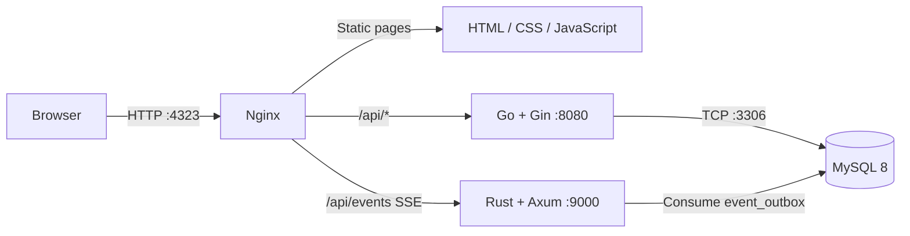

<p align="center">
  
</p>

<h1 align="center">IT Work Order System</h1>

<p align="center">
  Internal helpdesk and work-order platform for the IT team at SMK Mitra Industri MM2100.
</p>

## Overview

Work Order centralizes IT requests from submission through completion. Guests
can create and track requests, operators can take and execute work, and admins
can manage staff, approvals, shifts, evaluations, and reporting.

The application deliberately keeps the frontend simple: plain HTML, CSS, and
JavaScript served by Nginx. Go owns authentication and business data, while a
small Rust service consumes durable events and streams realtime updates.

## Features

- Guest request form with public tracking codes and requester notes
- Admin, Guru, Operator, and Guest roles with HttpOnly JWT sessions
- First-user Admin bootstrap and staff approval workflow
- Staff lifecycle management: pending, active, disabled, alumni, and batch
  graduation
- Work-order assignment, additional executors, priorities, and status flow
- Location-based safety checklists before work starts
- MySQL-backed live timer with Rust Server-Sent Events (SSE)
- Completion notes, admin notes, ratings, notes quality, and photo evidence
- Kaizen and summary views for operational review
- Optional Web Push notifications through persistent VAPID keys
- Responsive pages with clean URLs such as `/login`, `/guest`, and `/summary`

## Tech Stack

<p align="center">
  
</p>

## Architecture



| Service | Responsibility | Exposure |
| --- | --- | --- |
| Nginx | Static frontend and `/api` reverse proxy | Host port `4323` |
| Go backend | Auth, members, work orders, uploads, notifications | Internal `8080` |
| Rust engine | MySQL outbox consumer and authenticated SSE updates | Internal `9000` |
| MySQL 8 | Relational application data | Internal `3306` |

Podman Compose provides startup ordering and health checks. Only Nginx needs a
host port; the other services communicate through `workorder-net`.

## Requirements

- Podman
- A Compose provider available through `podman compose`
- Git
- `curl` for smoke checks

Go 1.21 and Rust 1.97 are only required when running tests directly on the
host. Container builds include their own toolchains.

## Quick Start

Clone the repository:

```bash
git clone https://github.com/teamitmivhs/work-order.git
cd work-order/src
```

Create `src/.env` with production-quality local secrets:

```env
DB_USER=workorder
DB_PASSWORD=replace_with_a_random_value
DB_NAME=dbwoit
MYSQL_ROOT_PASSWORD=replace_with_a_different_random_value
JWT_SECRET=replace_with_at_least_32_random_bytes
VAPID_PUBLIC_KEY=
VAPID_PRIVATE_KEY=
PUBLIC_UPLOAD_DIR=/static/public
```

Generate safe values with `openssl rand -hex 32`. VAPID keys are optional; Web
Push stays disabled when they are empty. Never commit `.env`.

Build and start the stack:

```bash
podman compose up -d --build
podman ps
```

Open:

| Page | URL |
| --- | --- |
| Dashboard | <http://localhost:4323/> |
| Login | <http://localhost:4323/login> |
| Registration | <http://localhost:4323/register> |
| Guest portal | <http://localhost:4323/guest> |
| Summary | <http://localhost:4323/summary> |
| Kaizen | <http://localhost:4323/kaizen> |
| Shift | <http://localhost:4323/shift> |
| Settings | <http://localhost:4323/settings> |
| Staff management | <http://localhost:4323/staff> |

Smoke check:

```bash
curl -fsS http://localhost:4323/login >/dev/null
podman logs work-order-backend --tail 100
podman logs work-order-db --tail 100
```

On a fresh database, the first registered staff account becomes the active
Admin. `src/db/complete_db.sql` also contains demo members for local simulation;
remove those records before exposing a production installation.

## Compose Variants

| File | Use case |
| --- | --- |
| `src/docker-compose.yml` | Local development with a named MySQL volume |
| `src/docker-compose.persistent.yml` | Production baseline with host storage |
| `src/docker-compose.external-db.yml` | Application stack using MySQL outside Compose |

The persistent compose file contains a baseline host path. Before production,
copy it to an ignored `src/docker-compose.server.yml` and set paths that match
the actual server. Keep MySQL data and uploaded files outside ephemeral
container storage. See [deployment.md](deployment.md) for the full server,
backup, recovery, and storage procedure.

## Testing

Backend:

```bash
cd src/backend
go test ./...
```

Rust engine:

```bash
cd src/rust-engine
cargo test
```

Deployment script:

```bash
./scripts/deploy-server.test.sh
```

Compose validation:

```bash
cd src
podman compose -f docker-compose.persistent.yml config >/dev/null
```

There is no large automated frontend suite. Verify UI changes manually on
desktop and mobile, including login, guest creation/tracking, staff approval,
work completion, and uploads.

## Server Updates

Production auto-deploy is intentionally opt-in. It requires:

- `src/docker-compose.server.yml`
- `src/.env`
- an executable backup command at
  `$HOME/.local/bin/work-order-backup`

Enable the tracked Git hook once on the server:

```bash
cd /opt/work-order
git config core.hooksPath .githooks
```

Future updates are then:

```bash
git pull --ff-only
```

After a successful pull, `.githooks/post-merge` runs
`scripts/deploy-server.sh`. It validates Compose, creates a backup, rebuilds and
restarts the stack, reloads Nginx, and checks the login page and protected API.
Run `./scripts/deploy-server.sh` directly when a rebuild is needed without a
pull.

## Database and Persistent Data

Main tables:

- `members`: identity, role, division, lifecycle, batch, and status
- `orders`: request, priority, tracking code, timing, notes, ratings, and photo
- `executors`: many-to-many work-order assignments
- `safetychecklist`: approved safety items per order
- `push_subscriptions`: Web Push endpoints and browser keys
- `shift_day_counter`: daily shift rollover state

MySQL entrypoint SQL only runs when its data directory is empty. Existing
production databases must receive new migrations explicitly after a backup;
never delete the data directory to force initialization.

## Security Notes

- JWT sessions use HttpOnly, SameSite cookies and become Secure behind HTTPS.
- Current member state and role are re-checked from MySQL on authenticated
  requests, so disabled or graduated users lose access immediately.
- Admin routes have server-side role checks.
- Login, registration, public tracking, and guest-note endpoints are rate
  limited per client IP.
- The Rust SSE endpoint is exposed through Nginx only after session validation.
- Avatar and documentation uploads validate image content and accept JPEG, PNG,
  or WebP.
- Secrets, tunnel credentials, `.env`, database files, and uploads must not be
  committed.

## Project Structure

```text
.
├── .githooks/                 # Optional server post-merge deployment hook
├── scripts/                   # Server deploy script and its lightweight test
├── deployment.md              # Production runbook
└── src/
    ├── *.html                 # Frontend pages
    ├── static/assets/         # Shared CSS, JavaScript, and service worker
    ├── static/public/         # Bundled images and runtime uploads
    ├── backend/               # Go API
    ├── rust-engine/           # Rust outbox consumer and SSE service
    ├── db/                    # Fresh schema and migrations
    ├── nginx/                 # Reverse-proxy configuration
    └── docker-compose*.yml    # Local, persistent, and external-DB stacks
```

## Contributing

1. Create a focused branch.
2. Keep changes small and follow existing patterns.
3. Run the relevant Go, Rust, Compose, or manual UI checks.
4. Use commit messages such as `[fix] clean login routes` or
   `[docs] update deployment guide`.
5. Include screenshots in pull requests for visible UI changes.

## License

Licensed under the [MIT License](LICENSE).
