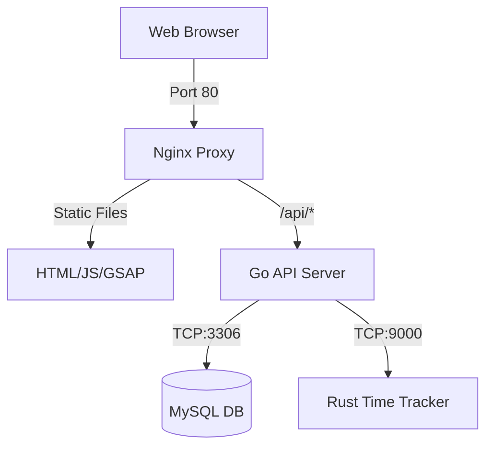

# 🛠️ IT Work Order System – MIVHS

[](https://golang.org)
[](https://www.rust-lang.org)
[](https://www.docker.com)
[](https://opensource.org/licenses/MIT)

> **Empowering the IT MIVHS Team** with a high-performance, microservices-driven work order and helpdesk management solution.

---

## 🌟 Overview

The **IT Work Order System** is a professional-grade platform designed to streamline IT support requests at **SMK MITRA INDUSTRI MM2100**. It combines the rapid development of **Go**, the safety and performance of **Rust**, and a modern, interactive frontend to deliver a seamless experience for both requesters and technicians.

### 🎯 Why This Project?
- **Speed**: Sub-millisecond time-tracking with our Rust engine.
- **Reliability**: Microservices architecture ensures the system stays up even if one component fails.
- **Transparency**: Real-time status tracking for every IT request.
- **Improvement**: Integrated **Kaizen** analytics to help the team grow.

---

## 🏗️ Architecture

Our system is built on a modern **Microservices** foundation:

| Service | Technology | Role |
| :--- | :--- | :--- |
| **API Gateway** | Nginx | Reverse proxy, SSL termination, & static file serving. |
| **Core Backend** | Go (Gin) | Orchestrates business logic, authentication, and database interactions. |
| **Rust Engine** | Rust (Axum) | Dedicated high-performance service for precise time tracking. |
| **Storage** | MySQL 8.0 | Persistent data storage with automatic health monitoring. |



---

## ✨ Key Features

### 🔧 For Technicians
- **Instant Assignment**: Take orders with a single click.
- **Safety First**: Integrated safety checklist requirements before starting any job.
- **Live Timers**: Automated work duration tracking powered by Rust.
- **Kaizen Notes**: Submit solutions and improvement ideas upon completion.

### 👤 For Requesters
- **Quick Submission**: Simplified forms for location, device, and problem description.
- **Priority Levels**: Flag urgent issues (High/Urgent) for immediate attention.
- **Real-time Status**: See exactly when your request moves from "Pending" to "On Progress".

### 📊 For Management
- **Summary Dashboard**: Full history of all completed work orders.
- **Performance Metrics**: Automated calculation of completion rates and response times.
- **Team Monitoring**: Real-time view of which team members are "Stand By" vs "On Job".

---

## 🚀 Quick Start

### 🐳 Using Docker (Recommended)
The fastest way to get started is using our pre-configured Docker Compose setup.

```bash
# 1. Clone the repository
git clone https://github.com/parothegreat/work-order.git
cd work-order

# 2. Fire up the engines
docker-compose up -d
```

**Access points:**
- 🏠 **Dashboard**: [http://localhost](http://localhost)
- 📊 **Summary**: [http://localhost/summary](http://localhost/summary)
- 💡 **Kaizen**: [http://localhost/kaizen](http://localhost/kaizen)

---

## 🛠️ Tech Stack

### **Frontend**
- **Vanilla JavaScript**: High performance with zero framework bloat.
- **GSAP**: Professional-grade animations for a "living" UI.
- **TailwindCSS**: Utility-first styling for a clean, modern look.

### **Backend & Engine**
- **Go (Gin)**: Handles high-concurrency API requests with ease.
- **Rust (Axum)**: Leveraging memory safety and speed for the time-tracking microservice.
- **JWT**: Secure, stateless authentication.

### **DevOps**
- **Docker & Docker Compose**: Consistent environment across development and production.
- **Nginx**: Optimized serving and routing.

---

## 📂 Project Structure

```text
.
├── src/
│   ├── backend/        # Go API Microservice
│   ├── rust-engine/    # Rust Time-Tracker Service
│   ├── db/             # SQL Initialization Scripts
│   ├── nginx/          # Proxy Configuration
│   ├── static/         # Frontend Assets (JS, CSS, Images)
│   └── *.html          # Main Application Pages
├── package.json        # Frontend Dependencies (GSAP)
└── docker-compose.yml  # Orchestration Config
```

---

## 📈 Kaizen Philosophy

We don't just fix devices; we improve processes. The system automatically calculates:
- **Completion Rate**: `%` of orders successfully resolved.
- **Efficiency Rating**: Based on resolution time vs. priority.
- **Feedback Loop**: Encouraging technicians to leave "Improvement Notes" for every task.

---

## 🤝 Contributing

We welcome contributions! Please feel free to:
1. Fork the project.
2. Create your feature branch (`git checkout -b feature/AmazingFeature`).
3. Commit your changes (`git commit -m 'Add some AmazingFeature'`).
4. Push to the branch (`git push origin feature/AmazingFeature`).
5. Open a Pull Request.

---

## 📝 License

Distributed under the **MIT License**. See `LICENSE` for more information.

---

<p align="center">
  Developed with ❤️ by <b>IT MIVHS Team</b><br>
  <i>"Efficiency through Engineering"</i>
</p>
