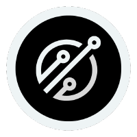
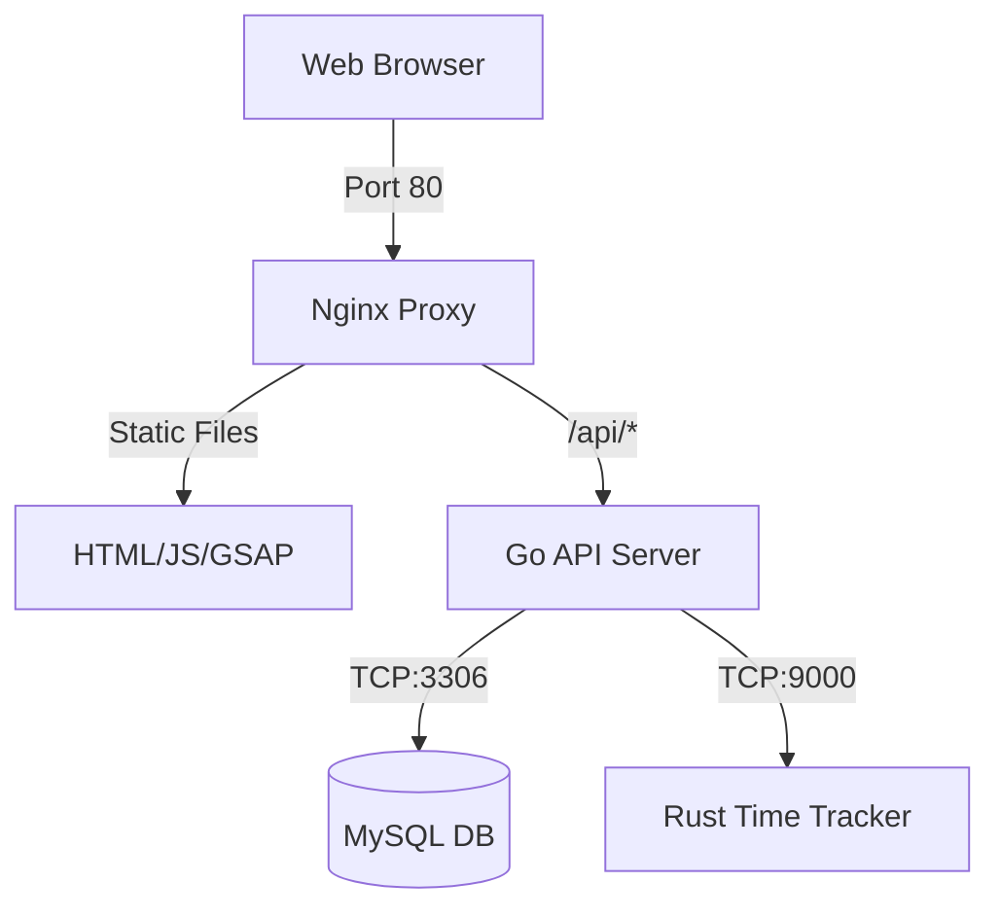

<p align="center">
  
</p>

<h1 align="center">IT Work Order System (MIVHS)</h1>

<p align="center">
  <b>A High-Performance, Microservices-Driven Helpdesk & Work Order Management Solution</b>
</p>

<p align="center">
  <a href="https://skillicons.dev">
    
  </a>
</p>

---

## Table of Contents
* [Overview](#overview)
* [System Architecture](#system-architecture)
* [Key Features](#key-features)
* [System Workflow](#system-workflow)
* [Quick Start (Docker)](#quick-start-docker)
* [Project Structure](#project-structure)
* [Manual Development Setup](#manual-development-setup)
* [Database & Security](#database--security)
* [Contributing](#contributing)
* [License](#license)

---

## Overview

The **IT Work Order System** is a professional-grade platform designed to streamline IT support requests at **SMK MITRA INDUSTRI MM2100**. By combining the concurrency of **Go (Gin)**, the microsecond precision of **Rust (Axum)**, and a highly responsive frontend powered by **GSAP** and **TailwindCSS**, it delivers an unmatched tracking and resolution experience.

> [!NOTE]
> This project implements a modern microservices architecture. The core application logic, database operations, and high-precision tracking are separated into distinct services communicating over secure channels.

---

## System Architecture

### Service Orchestration
The frontend, backend, database, and timer services are orchestrated seamlessly:

| Service | Stack | Role | Port |
| :--- | :--- | :--- | :--- |
| **API Gateway** | `Nginx` | Reverse proxy, static file serving, and endpoint routing | `80` (Host) |
| **Core Backend** | `Go` / `Gin` | Business logic, JWT session security, and API endpoints | `8080` (Internal) |
| **Rust Engine** | `Rust` / `Axum` | High-efficiency microsecond work-timer tracking | `9000` (Internal) |
| **Storage** | `MySQL 8.0` | Relational application schema and performance state | `3306` (Internal) |

### Communication Flow


---

## Key Features

### For Technicians
* **One-Click Assignment**: Instantly claim pending orders.
* **Safety Protocol Checklist**: Mandatory location-based checks before starting tasks.
* **Live Precision Timers**: Automatic job duration recording managed by the Rust tracking service.
* **Kaizen Integration**: Enter solutions and improvement metrics immediately upon completion.

### For Requesters
* **Simplified Submission**: Quickly report issues with specified locations and devices.
* **Priority Escalation**: Categorize requests (Low, Medium, High) for urgent dispatch.
* **Real-time Status Feed**: Visually track requests from *Pending* to *Completed*.

### For Administrators
* **Centralized Dashboard**: Live telemetry of "Stand By" vs "On Job" operators.
* **Kaizen Analytics**: Automatic calculation of completion rates and performance ratings.
* **Audit Logs**: Maintain structured histories of all work orders.

### Technical Highlights
* **Microservices Orchestration**: Fully containerized setup with health checks.
* **JWT Authentication**: Secure, state-managed sessions for administrators and operators.
* **Failure Resilience**: Automatic connection retry and validation loops.

---

## System Workflow

```
[Requester] Creates Work Order
      ↓
[System] Adds to Queue as "Pending"
      ↓
[Technician] Takes Order (Approves Safety Checklist)
      ↓
[System] Status: "On Progress" | Start Rust Live Timer
      ↓
[Technician] Executes Job & Marks as Done
      ↓
[System] Status: "Completed" | Stop Rust Live Timer | Log Working Hours & Kaizen Notes
      ↓
[Dashboard] Performance Summary Updated
```

<details>
<summary><b>Expand Detailed Step-by-Step Workflow</b></summary>

### 1. Create Work Order
- **Action**: User fills form (Requester name, Priority, Location, Device, and Problem description).
- **Result**: Order enters table in Nginx dashboard with status `Pending`.

### 2. Take Order (Assign)
- **Action**: Technician clicks order ID, assigns operators (who must be in `Stand By` status), reads and approves location safety checklist, and confirms.
- **Result**: Order moves to `On Progress`. Assigned technicians' status changes from `Stand By` to `On Job`.

### 3. Work in Progress
- **Action**: Rust time-tracker service initializes and records start timestamp.
- **Result**: Live timer is displayed and tracked.

### 4. Mark as Done
- **Action**: Technician completes work, clicks `Done`, and inputs optional evaluation/solution notes.
- **Result**: Order moves to `Completed`, technician status returns to `Stand By`, and Rust service computes elapsed time.

### 5. Review & Kaizen Analytics
- **Action**: Admins view performance metrics in the Kaizen page.
- **Result**: Auto-calculated Completion Rates and actionable feedback ratings.
</details>

---

## Quick Start (Docker)

### 1. Prepare Environment
Clone the repository and create your configuration file:
```bash
git clone https://github.com/parothegreat/work-order.git
cd work-order
cp src/.env.example src/.env
```

### 2. Spin Up Containers
Launch the stack using Docker Compose:
```bash
docker-compose -f src/docker-compose.yml up -d --build
```

### 3. Access the Platforms
> [!TIP]
> Use the following URLs to access the application after containers start:
> - **Main Dashboard**: [http://localhost](http://localhost)
> - **Order Summary**: [http://localhost/summary](http://localhost/summary)
> - **Kaizen Analytics**: [http://localhost/kaizen](http://localhost/kaizen)
> - **Technical Guide**: [http://localhost/techguide](http://localhost/techguide)

---

## Tech Stack

<p align="center">
  <a href="https://skillicons.dev">
    
  </a>
</p>

---

## Project Structure

```text
work-order/
├── src/
│   ├── backend/        # Go API Microservice (Gin Framework)
│   ├── rust-engine/    # Rust Time-Tracker Service (Axum)
│   ├── db/             # SQL Schema & Migration scripts
│   ├── nginx/          # Nginx Reverse Proxy Config
│   ├── static/         # Frontend Assets (JS, CSS, Images, Logos)
│   └── *.html          # Static HTML Templates
├── package.json        # Frontend dependencies & configurations
└── docker-compose.yml  # Orchestration configuration
```

---

## Manual Development Setup

If you prefer running services outside of Docker for development, use the following guides:

<details>
<summary><b>Go Backend Setup</b></summary>
<br>

<p align="left">
  
</p>

```bash
cd src/backend
go mod tidy
go run main.go
```
Make sure you have Go 1.21+ installed and access to a running MySQL instance.
</details>

<details>
<summary><b>Rust Time-Tracker Setup</b></summary>
<br>

<p align="left">
  
</p>

```bash
cd src/rust-engine
cargo build --release
cargo run
```
Requires Rust 1.70+. Service listens on port `9000` by default.
</details>

<details>
<summary><b>Database Setup</b></summary>
<br>

<p align="left">
  
</p>

Restore the schema to a local MySQL instance:
```bash
mysql -u <user> -p <database_name> < src/db/complete_db.sql
```
</details>

---

## Database & Security

### Schema Tables
* `orders`: Work order parameters (requester, device, location, working hours, notes).
* `members`: Operator login details, password hashes, and statuses.
* `executors`: Mapping assignments linking operators to specific tasks.
* `safety_checklist`: Safety compliance checklist responses.

### Security Configurations
* **Stateless Session Management**: Powered by JWT.
* **Rate Limiting**: Integrated client rate-limiting on login/registration pages (max 10 req/min).
* **Internal Authentication**: Shared key header (`X-Internal-Key`) secures calls between the Go backend and Rust engine.

---

## Contributing

1. Fork the repository.
2. Create your feature branch: `git checkout -b feature/AmazingFeature`.
3. Commit your changes: `git commit -m 'feat: Add some AmazingFeature'`.
4. Push to the branch: `git push origin feature/AmazingFeature`.
5. Open a **Pull Request**.

---

## License

Distributed under the **MIT License**. See `LICENSE` for more information.

---

<p align="center">
  Developed with ❤️ by the <b>IT MIVHS Team</b><br>
  <i>"Maintain tasks with ease and efficiency"</i>
</p>
